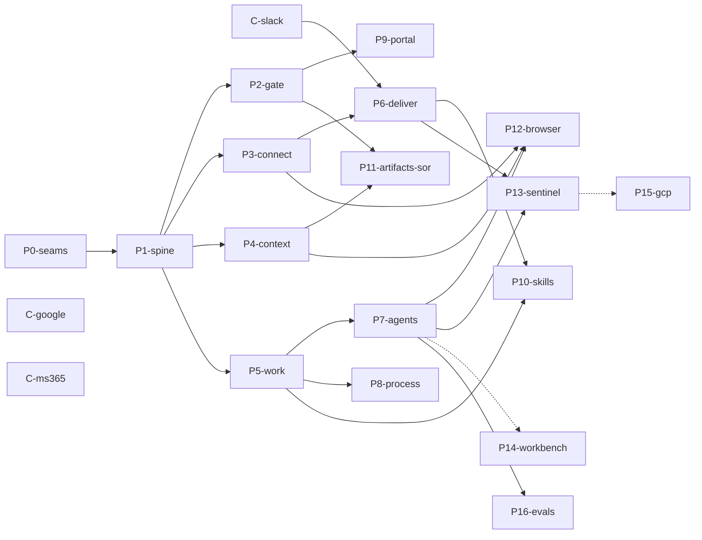

# Build-out phases

The roadmap from skeleton to production, restructured as a dependency DAG so
phases can be developed **in parallel git worktrees** (see
[CONTRIBUTING.md](../CONTRIBUTING.md#parallel-phase-development) for the
worktree/branch conventions). Update the Status column as phases land — this
file is the tracker of record.

Statuses: `todo` · `in progress` · `in review (PR #)` · `done (PR #)`

## Phases

| Phase | Status | Scope (stub ids going real) | Hard deps | Credentials | Acceptance |
|---|---|---|---|---|---|
| **P0-seams** | done (PR #2) | Conflict-seam refactor: per-module API route files, per-module stub tests, per-domain topic files, pre-declared env vars, this file | — | — | `bun run check` green; stub census byte-identical |
| **P1-spine** | done (PR #3) | `server.db.migrate.apply`, `server.spine.events.*`, `server.spine.clock.tick`, `server.iam.identity.*`, `cli.init` — Bun SQL db module, transactional outbox, polling dispatcher + durable cursors, clock w/ TickSource registry, identity CRUD + dev seed, Postgres integration-test harness | P0 | — | events flow compose-locally; dispatcher resumes from checkpoint after restart |
| **C-slack** | done (PR #11) | `connector.slack.*` — fetch-based Slack Web API (no SDK dep) · *port: crm Slack client* | — | Slack bot token (live smoke only) | fixture-replay sync through a fake IngestSink |
| **C-google** | todo | `connector.google-workspace.*` — Gmail/Calendar REST (no googleapis dep) · *port: crm Google collectors* | — | Google OAuth (live smoke only) | fixture-replay → typed doc inputs; idempotent re-sync |
| **C-ms365** | todo | `connector.microsoft-365.*` via Graph API | — | Entra app | same shape as C-google; wave-4 filler |
| **P2-gate** | done (PR #5) | `server.humangate.gate.*`; POST request/resolve routes; SLA follow-up TickSource | P1 | — | request→inbox→resolve round-trip; SLA escalation fires on tick |
| **P3-connect** | done (PR #7) | `server.connections.registry.*`, feed-expectation TickSource, `server.custody.broker.getBrokered` (secret store; `mountSession` stays stubbed), orchestrator sync loop | P1 | — | scheduled sync persists cursor + emits events; missed feed flags |
| **P4-context** | done (PR #6) | `server.context.store.*` — Bun.s3 blobs, quarantined ingest, FTS+pgvector search, distill behind ANTHROPIC_API_KEY (graceful degrade), basic paths | P1 | Anthropic key (distill only) | ingest fixture emails → searchable; doc events on spine |
| **P5-work** | done (PR #4) | `server.work.queue.*` — SKIP LOCKED leases, expiry-reclaim TickSource, edges, notes | P1 | — | open→claim→heartbeat→lapse→reclaim by a second worker |
| **P6-deliver** | done (PR #15) | `server.delivery.delivery.*` — Slack evidence cards via connector.act + brokered auth; inbound Socket Mode → `conversation.message` + resolve mapping · *port: crm card formats / reply-resolve UX* | P1, P3, C-slack (soft: P2) | Slack app w/ Socket Mode | approve a humangate request from Slack |
| **P7-agents** | done (PR #13) | `server.agents.{host,executor,toolbroker}.*` — resident loop, briefs, transcripts, cost, budget abort · *port: cass/openclaw wake taxonomy + loop discipline* | P1, P5 (soft: P2, P4) | ANTHROPIC_API_KEY; dep-chore PR: `@anthropic-ai/sdk` | seeded resident agent autonomously works 3 items; budget abort mid-run |
| **P8-process** | done (PR #14) | `server.processes.engine.*` — nodes as WorkItems, WatchRules, Invalidator, cascades; wire the 3-node underwriting template · *port: trellis invalidation semantics* | P1, P5 (soft: P2, P4, P7) | — | new-doc cascade + deny cascade run live |
| **P9-portal** | done (PR #12) | Portal screens over real routes (Inbox resolve UI first) — `apps/portal/` only; screens degrade to stub cards | P2 (each screen soft-deps its module) | — | approve from the portal end-to-end |
| **P10-skills** | done (PR #18) | `server.skills.registry.*` + follow-up-cadence & weekly-report skills | P1, P5, P6 | — | cadence skill fires a Slack nudge on tick; weekly digest renders |
| **P11-artifacts-sor** | todo | `server.artifacts.engine.*`, `server.sor.runtime.*` — template render/verify; AMS provisioning; approval-gated SoR migrations | P1, P4, P2 | — | render+verify an artifact; SoR migration approved + applied |
| **P12-browser** | todo | `apps/browserhost`, `server.custody.broker.mountSession`, `connector.linkedin.*`, ActionIntent batches, path ranking, linkedin-bd pack · *port: crm scraper selectors + salesnav pathfind* — split infra/pack into 2 PRs | P3, P7, P4 | LinkedIn session | ActionIntent batch executes in a sealed session with receipts; ranked 2nd-degree targets |
| **P13-sentinel** | done (PR #17) | `server.sentinel.*` — default watcher charters, conversation watchers, findings routing | P1, P6, P7 | — | concerning message → routed finding card |
| **P14-workbench** | todo | per-tenant containers, PR-only egress | P1 (soft P7) | — | workspace lifecycle events |
| **P15-gcp** | todo | Cloud Run/SQL/PubSub SpineDriver adapters (`deploy/` only) | a system worth deploying | GCP project | reference deploy runs |
| **P16-evals** | todo | `evals.replay.harness` — replay over readSince + agent-run replay | P1 (full value: P7) | — | replay a recorded run |

## Dependency DAG

**Critical path:** P1 → P5 → P7 → P12/P13. Everything else hangs off P1 at
depth ≤ 2. The connector track (C-*) has no server dependencies at all.

Milestone shortcuts:
- **Slack loop live** (crm migration): P1 → {P3, C-slack} → P6
- **Resident agent live** (openclaw migration): P1 → P5 → P7
- **Real inbox → searchable entities**: P1 → {P3, P4, C-google} (no extra phase)

## Wave schedule (up to 3 concurrent worktree sessions)

| Wave | Session A | Session B | Session C |
|---|---|---|---|
| 1 (now) | P0 → P1 | C-slack | C-google |
| 2 (P1 merged) | P5-work | P2-gate | P4-context → P3-connect |
| 3 | P7-agents | P6-deliver | P8-process or P9-portal |
| 4 | P12-browser | P10-skills → P13-sentinel | P11, P9-portal, C-ms365 |
| 5 | P14 | P15 | P16 |

Merge order within a wave: first-done merges first; everyone else rebases
same-day. P9-portal is the ideal filler track — it never conflicts with
server phases.

## Migration mapping (existing running systems → phases)

| Existing system | Lands in | What gets ported |
|---|---|---|
| crm Slack loop — client code | C-slack | Web API call patterns, cursor sync, rate limits |
| crm Slack loop — cards, reply-resolve UX | P6-deliver | evidence-card layouts, resolve-by-reply mapping |
| crm Google collectors | C-google + P4-context | Gmail/Calendar fetch + normalization; distill heuristics |
| crm entity/relationship model | P4-context | person/company link verbs, degree tracking |
| crm LinkedIn scraper + salesnav pathfind | P12-browser | selectors as fixture-tested parsers; path-ranking heuristics |
| cass/openclaw resident agent | P7-agents | wake-reason taxonomy, loop cadence, budget/abort discipline |
| trellis graph-task patterns | P8-process (+P5) | node keys, dirty-propagation, rerun semantics |

## Follow-ups minted by wave 4a (P10 #18 + P13 #17)

- Agent-facing `reassign` tool (ownership is Jira-assignee-style, changeable by
  any agent; only the WorkQueue method shipped).
- Sentinel bridge idempotency under at-least-once redelivery (dedupe watch
  items by source event id) + batching/filtering for high-volume topics.
- `iam.charter.created` actor should be the caller, not the chartered principal.
- Weekly digest default window: Monday-08:00 run covers only the new week's
  first hours — decide previous-week default vs explicit `weekOf`.
- Per-counterpart email nudges (`skill.follow-up-cadence.send.email`) need
  entity→channel resolution + C-google/C-ms365.
- Relationship read surface for the digest's relationships section.
- `evidenceIds` on watcher findings (needs mid-run evidence minting).
- Eval gate wiring (`server.skills.registry.evalgate`, P16-evals).
- Tenant-scoped connections list overload (invoker fabricates a
  PrincipalContext today).
